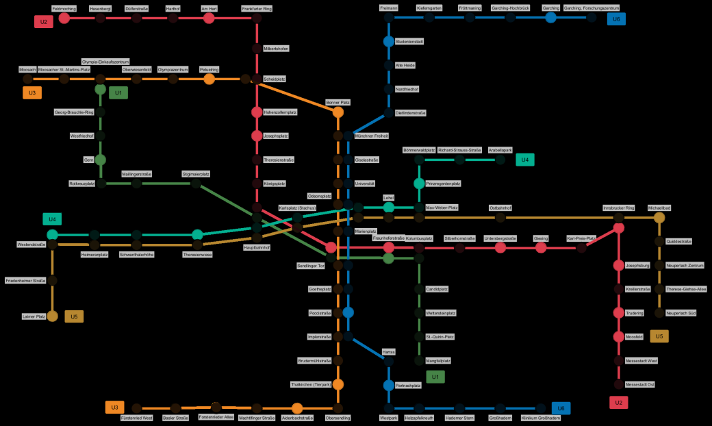

# CppND-ProjectCapstone_BinaryBandit81

Program to monitor if a subwaytrain is currently at a station for the complete subway in Munich.
The Code is derived from https://github.com/udacity/CppND-Program-a-Concurrent-Traffic-Simulation

## What it does
1. Open the subwaystation map '/data/mvg_subwaystations.png'
2. read subwayline from file '/data/lines.csv'
3. read a stationlist from file '/data/stations.csv'
4. start a thread for every subwaystation
5. in every thread:
  - request the current departures via http with a request like this: https://www.mvg.de/api/fahrinfo/departure/de:09162:130?footway=0
  - check if a subwaytrain is at the stationdraw a colored dot on the map at the station location
  - remove all trains from station that have left the station

## Dependencies
* cmake >= 3.11
* make >= 4.1 (Linux, Mac), 3.81 (Windows)
* gcc/g++ >= 5.4
* OpenCV >= 4.1
* install vcpkg 
  * https://vcpkg.io/en/getting-started.html
* curl
  * vcpkg install curl
* curlpp
  * vcpkg install curlpp
* protobuf
  * vcpkg install protbuf
* jsoncpp
  * vcpkg install jsoncpp

## Basic Build Instructions
1. Make a build directory in the top level directory: `mkdir build && cd build`
2. Compile: `cmake .. && make`
3. Run it: `./CapStone`.

## Covered rubrics
- The Project is mainly focussed on threads and reading data from files and from http requests.
- It uses classes whereever useful.
- To exchange information between the classes smart pointers are used

## Known Issues
- Window does not start in fullscreen
- Unkown error (probably json related) ('Line 1, Column 1  Syntax error: value, object or array expected.)
- Not all stations seem to update properly
